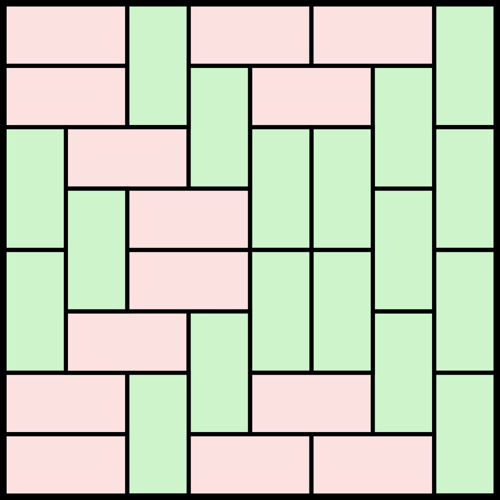

# Counting Tiles

Q. Count the **number of ways** to fill in an RxC grid with tiles of size 1x2 and 2x1.



Solution: **781**

## Logic

Again, the solution can be divised by solving the grid row by row.

Let's think of a possible solution for a 4\*7 grid:



```
1 3 4 1 3 4 1
2 3 4 2 1 1 2
3 4 3 4 2 2 1
3 4 3 4 3 4 2

1 - top
2 - bottom

3 - left
4 - right
```



Let `count(k, x)` denote the number of ways to construct a solution for rows 1...k and x is the 'string' of that row. \(such as "1341341"\)

There are 4 choices for each character, we have a maximum of $$4^C $$, and since we have to read the previous row for validity, the complexity becomes $$4^{2C}$$. The overall complexity is $$R \cdot 4^{2C}$$

## optimizations

1. Rotate so that C &lt; R, since C has a much greater contribution to the complexity
2. We only really need to know the positions of tile-1, so the above data structure and simply become a bitset.

With these two, the complexity is now $$O(n \cdot 2^{2m})$$where m is the smaller side of the grid.

